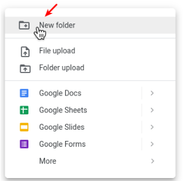
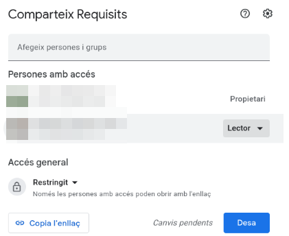
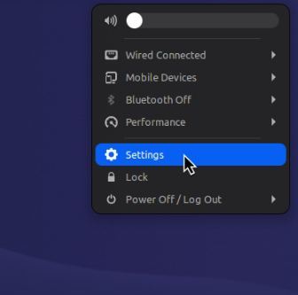
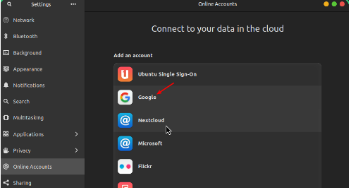
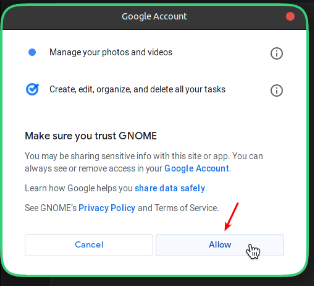
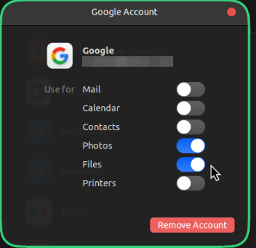
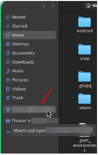
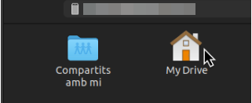
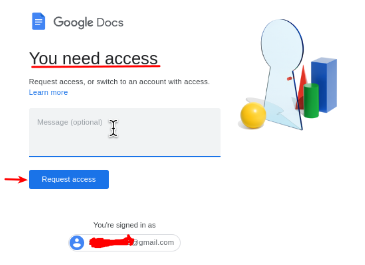

# CAS PRÀCTIC 1 | Google Drive
## Índex de continguts
- Perquè penseu que aquesta és una bona solució al nostre problema
- El pressupost mensual i anual de la despesa del servei a contractar
- Guia de creació de les unitats compartides BACKUP i DOCUMENTS on es vegin els permisos assignats a cada tipus d’usuari/a
- Guia d’instal·lació d’adreces directes als escriptoris dels dos tipus d’usuaris: Administrador/a i usuari/a
- Exemples d’ús de fer un backup per part de l’administrador/a
- Emples d’ús de consultar un document per part de l’usuari/a
- Comproveu si un usuari/a pot eliminar sense voler algun document.

### Perquè penseu que aquesta és una bona solució al nostre problema
- Es una bona solució ja que Google Drive es un servici d’almacenament facil d’usar, això ajuda als treballadors de l’empresa amb menys coneixements informàtics.

### El pressupost mensual i anual de la despesa del servei a contractar.
2TB de emmagatzematge costará 9,99€ al mes o 99,99€ al any, ens sortiria un 17% mes barat si seleccionem la tarifa anual. Aquestes son les avantatges que ens ofereix
- 2TB de almacenament
- Experts de google en suport
- Es pot compartir el plan fins amb 5 persones
- Beneficis addicionals per membres
- Funcions premium de Google Workspace
- VPN per iOS i Android

### Guia de creació de les unitats compartides BACKUP i DOCUMENTS on es vegin els permisos assignats a cada tipus d’usuari/a.
1. Mun anem al Google Drive i crearem una carpeta nova.

2. Tornem al lloc on hem creat aquesta carpeta i li donarem click dret i triar l'opció de compartir.

3. Afegirem organització o usuaris específics a l’apartat d’escriure. Una vegada hem acabat, fem a FET, i ja es compartiría amb el usuari que hem posat.

4. Després ja podem modificar els permisos que vulguem. N’hi ha per només veure, només comentar, i editar totalment.

### Guia d’instal·lació d’adreces directes als escriptoris dels dos tipus d’usuaris: Administrador/a i usuari/a.
#### Administradors en ubuntu:

1. Hem d’anar a les paràmetres de ubuntu.

2. Buscarem comptes en línia.

3. Afegirem un nou compte de Google.

4. Iniciem la sessió i confirmem els permisos que vol GNOME.

5. Acceptarem els permisos que necessita, per tant li donarem a aprovar.

6. Després hem d’activar només la sincronització de només Fotos i Arxius.

7. Veurem ara en el nostre explorador d’arxius en Ubuntu que ens apareixerà el nostre Drive online.

 

### Exemples d’ús de consultar un document per part de l’usuari/a.

1. Ells obriran un enllaç que hem compartit, pero amb els permisos restringits. Com aquest per exemple: https://docs.google.com/document/d/1X_AmoKzm1uuQ7rGl6FoVQCxfseTu3BcZWCym-KcBeSk/edit?usp=sharing

2. Els apareixerà una pantalla per enviar una sol·licitud per a que l’admin li donigue accés al document i poden afegir un motiu. Una vegada ja estem, li donem a request access.

3. Una vegada l’admin aprova la solicitud, l‘usuari pot accedir.

### Comproveu si un usuari/a pot eliminar sense voler algun document.

L’usuari no podrà eliminar cap arxiu de manera erronea o vulguen. 
